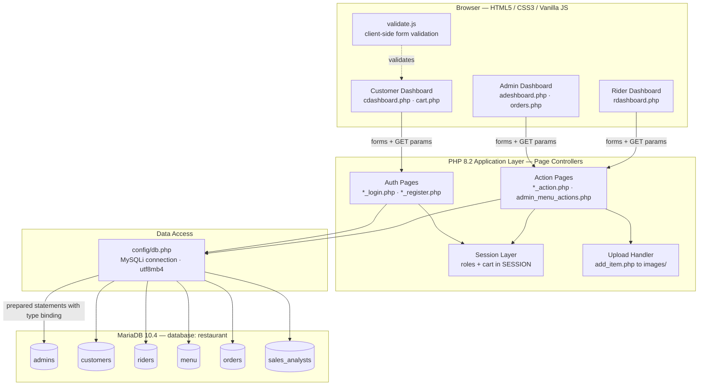
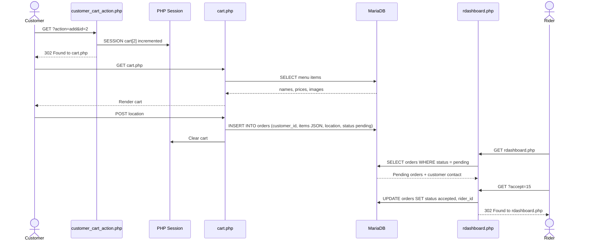
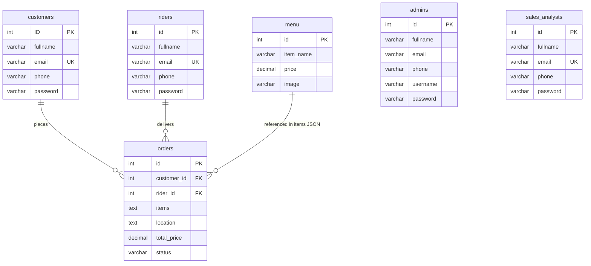

<a id="top"></a>

<div align="center">

# Online Restaurant Management System

**Order, dispatch, and administer a restaurant from one vanilla PHP stack — no frameworks, no build step.**

[](LICENSE)

[](https://www.php.net/)
[](https://mariadb.org/)
[](https://www.phpmyadmin.net/)
[](https://httpd.apache.org/)

[](CONTRIBUTING.md)
[](https://github.com/thats-saidul/Online-Restaurant-Management-System/commits)

[Features](#-features) · [Installation](#installation) · [Usage](#-usage-examples) · [API](#-api-reference) · [Contributing](#-contributing)

</div>

---

<details>
<summary><strong>Table of Contents</strong></summary>

- [Overview](#-overview)
- [Features](#-features)
- [Demo / Screenshots](#-demo--screenshots)
- [Tech Stack](#-tech-stack)
- [Architecture](#-architecture)
- [Getting Started](#-getting-started)
  - [Prerequisites](#prerequisites)
  - [Installation](#installation)
  - [Configuration](#configuration)
  - [Running](#running)
- [Usage Examples](#-usage-examples)
- [API Reference](#-api-reference)
- [Database Schema](#-database-schema)
- [Project Structure](#-project-structure)
- [Testing](#-testing)
- [Deployment](#-deployment)
- [Roadmap](#-roadmap)
- [Troubleshooting & FAQ](#-troubleshooting--faq)
- [Contributing](#-contributing)
- [License](#-license)
- [Acknowledgments](#-acknowledgments)
- [Contact & Support](#-contact--support)

</details>

---

## 📋 Overview

A full-stack PHP web application for managing restaurant operations: customer ordering, menu management, rider delivery coordination, and sales analytics.

The system serves four roles from one codebase. Customers browse and purchase menu items online. Riders accept and manage deliveries. Administrators oversee the menu, users, and orders. A `sales_analysts` role exists in the schema for analytics.

No framework, no package manager, no build step. Server-rendered PHP talking to MariaDB over MySQLi prepared statements.

<p align="right"><a href="#top">back to top ↑</a></p>

---

## ✨ Features

| Feature | Description |
|---|---|
| **Multi-role authentication** | Separate login systems for customers, administrators, riders, and sales analysts with bcrypt password hashing |
| **Customer portal** | Browse menu with images, add items to cart, place orders with delivery location, manage profile |
| **Admin dashboard** | Add, update, and delete menu items; view customer and rider lists; delete users; monitor all orders |
| **Rider delivery system** | Accept pending orders, view customer contact info and delivery locations, manage active deliveries |
| **Menu management** | Dynamic menu with item names, prices, and images stored in the database |
| **Order tracking** | Orders tracked by status (`pending` / `accepted`), linked to customers and riders with JSON-encoded item lists |
| **Session shopping cart** | Items held in PHP sessions, persisted until order confirmation |
| **Form validation** | Client-side JavaScript validation for registration (name, email, phone, password complexity); server-side SQL prepared statements |

<p align="right"><a href="#top">back to top ↑</a></p>

---

## 🖼 Demo / Screenshots

> Live demo: `<LIVE_DEMO_URL>` — not yet deployed.

| View | Screenshot |
|---|---|
| Customer dashboard | `docs/screenshots/customer-dashboard.png` |
| Cart & checkout | `docs/screenshots/cart.png` |
| Admin dashboard | `docs/screenshots/admin-dashboard.png` |
| Rider dashboard | `docs/screenshots/rider-dashboard.png` |

<p align="right"><a href="#top">back to top ↑</a></p>

---

## 🧰 Tech Stack

| Layer | Technology | Version |
|---|---|---|
| Language | PHP | 8.2.12 |
| Database | MariaDB | 10.4.32 (MySQL 5.7+ compatible) |
| Frontend | HTML5, CSS3, JavaScript (vanilla) | — |
| Web server | Apache (via phpMyAdmin stack) | — |
| Database tool | phpMyAdmin | 5.2.1 |
| Authentication | bcrypt (`PASSWORD_DEFAULT`) | — |
| DB driver | MySQLi with prepared statements | — |

<p align="right"><a href="#top">back to top ↑</a></p>

---

## 🏗 Architecture

The application follows a **page-based, MVC-adjacent pattern**:

- **Entry points** — one login page per role: `index.php`, `admin.php`, `rider.php`
- **Business logic** — inline within page files; `*_action.php` files handle form processing
- **Session management** — user roles stored in `$_SESSION`, with authentication checks on protected pages
- **Data layer** — direct MySQLi prepared statements to prevent SQL injection
- **Presentation** — server-side rendered HTML with embedded PHP

### Component diagram



### Order lifecycle — sequence



<p align="right"><a href="#top">back to top ↑</a></p>

---

## 🚀 Getting Started

### Prerequisites

| Requirement | Version | Notes |
|---|---|---|
| PHP | 8.2.12 or higher | `mysqli` extension required |
| MariaDB | 10.4.32 or higher | MySQL 5.7+ compatible |
| Web server | Apache | `mod_rewrite` enabled |
| Browser | Modern | JavaScript enabled |

Verify your toolchain:

```bash
php -v
php -m | grep mysqli
mysql --version
```

Expected output (abridged):

```text
PHP 8.2.12 (cli) (built: ...)
mysqli
mysql  Ver 15.1 Distrib 10.4.32-MariaDB, for Win64
```

---

### Installation

**1. Clone the repository**

```bash
git clone https://github.com/thats-saidul/Online-Restaurant-Management-System.git
cd Online-Restaurant-Management-System
```

**2. Set up the database**

Open phpMyAdmin at `http://localhost/phpmyadmin`, create a database named `restaurant`, then import the schema:

```bash
mysql -u root -p restaurant < database/restaurant.sql
```

**3. Configure the database connection**

Edit `config/db.php`:

```php
$host     = "localhost";
$db_name  = "restaurant";
$username = "root";
$password = "";  // Your MySQL password
```

**4. Set up directories**

Ensure `images/` exists and is writable for menu item uploads.

<details>
<summary><strong>Linux / macOS</strong></summary>

```bash
mkdir -p images
chmod 755 images
```

</details>

<details>
<summary><strong>Windows (PowerShell)</strong></summary>

```powershell
New-Item -ItemType Directory -Force -Path images
```

</details>

---

### Configuration

| Variable | Description | Required | Default | Location |
|---|---|:---:|---|---|
| `$host` | Database server hostname | ✅ | `localhost` | `config/db.php` |
| `$db_name` | Database name | ✅ | `restaurant` | `config/db.php` |
| `$username` | Database user | ✅ | `root` | `config/db.php` |
| `$password` | Database password | ❌ | `` (empty) | `config/db.php` |
| `$conn->set_charset()` | Character set | ✅ | `utf8mb4` | `config/db.php` |
| Upload directory | Menu item images path | ✅ | `images/` | `add_item.php` L21 |
| Image naming | Timestamp + original filename | — | `time()_filename` | `add_item.php` L22 |

> Credentials are currently hard-coded in `config/db.php`. Environment-variable configuration is on the [roadmap](#-roadmap).

---

### Running

**Development**

```bash
php -S localhost:8000
```

Expected output:

```text
PHP 8.2.12 Development Server (http://localhost:8000) started
```

Or serve the directory with Apache via XAMPP/WAMP.

**Entry points**

| Role | URL |
|---|---|
| Customer | `http://localhost:8000/index.php` |
| Admin | `http://localhost:8000/admin.php` |
| Rider | `http://localhost:8000/rider.php` |

**Production**

- Deploy to Apache or nginx with PHP-FPM.
- Set up an SSL certificate for HTTPS.
- Configure the database on the production server.
- Set appropriate file permissions on `images/`.
- Use environment variables or a `.env` file for database credentials *(not currently implemented)*.

<p align="right"><a href="#top">back to top ↑</a></p>

---

## 💡 Usage Examples

**Customer login**

```http
POST /customer_login.php HTTP/1.1
Content-Type: application/x-www-form-urlencoded

email=customer@example.com&password=ExamplePass123!
```

```text
Response: 302 Found → cdashboard.php
```

**Add an item to the cart**

```http
GET /customer_cart_action.php?action=add&id=2 HTTP/1.1
```

```text
Response: 302 Found → cart.php   (item added to $_SESSION['cart'][2])
```

**Add a menu item (admin)**

```http
POST /add_item.php HTTP/1.1
Content-Type: multipart/form-data

item_name=Pizza&price=450.00&image=<binary_file>
```

```text
Response: 302 Found → adeshboard.php
Menu item inserted into database with image at: images/1748986439_pizza.jpg
```

**Accept a delivery (rider)**

```http
GET /rdashboard.php?accept=15 HTTP/1.1
```

```text
Updates orders table (SET status='accepted', rider_id=<session_rider_id>)
Response: 302 Found → rdashboard.php
```

<p align="right"><a href="#top">back to top ↑</a></p>

---

## 🔌 API Reference

Routes are server-rendered PHP pages. `Auth` indicates the session required to reach the page.

### Customer

| Method | Endpoint | Auth | Description | Parameters | Response |
|---|---|---|---|---|---|
| `GET` | `index.php` | Public | Customer login form | — | HTML form |
| `POST` | `customer_login.php` | Public | Authenticate customer | `email`, `password` | Redirect to `cdashboard.php` or error message |
| `GET` | `customer_register.php` | Public | Registration form | — | HTML form |
| `POST` | `customer_register_action.php` | Public | Create customer account | `fullname`, `email`, `phone`, `password`, `cpassword` | Redirect to `index.php` on success |
| `GET` | `cdashboard.php` | Customer | Menu display | — | HTML with menu items from DB |
| `GET` | `customer_cart_action.php` | Customer | Add item to cart | `action=add`, `id=<menu_id>` | Redirect to `cart.php` |
| `GET` `POST` | `cart.php` | Customer | View cart & confirm order | `location` (POST) | HTML cart display or order creation |
| `GET` `POST` | `update_customer.php` | Customer | Update profile | `fullname`, `email`, `phone`, `password` | HTML form or redirect on success |
| `GET` | `logout.php` | Customer | Destroy session | — | Redirect to `index.php` |

### Admin

| Method | Endpoint | Auth | Description | Parameters | Response |
|---|---|---|---|---|---|
| `GET` | `admin.php` | Public | Admin login form | — | HTML form |
| `POST` | `admin_login.php` | Public | Authenticate admin | `username`, `password` | Redirect to `adeshboard.php` or error |
| `GET` | `adeshboard.php` | Admin | Dashboard | — | HTML with users, menu, links |
| `GET` `POST` | `add_item.php` | Admin | Add menu item | `item_name`, `price`, `image` (file) | HTML form or redirect on success |
| `POST` | `admin_menu_actions.php` | Admin | Update or delete menu item | `id`, `price` (for update), `action=update/delete` | Redirect to `adeshboard.php` |
| `POST` | `delete_user.php` | Admin | Remove customer or rider | `id`, `type=customer/rider` | Redirect to `adeshboard.php` |
| `GET` | `orders.php` | Admin | View all orders | — | HTML table with order details |
| `GET` `POST` | `update_admin.php` | Admin | Update admin profile | `fullname`, `email`, `phone`, `username` | HTML form or redirect on success |
| `POST` | `update_admin_password.php` | Admin | Change password | `password`, `cpassword` | JSON or redirect |
| `GET` | `alogout.php` | Admin | Destroy session | — | Redirect to `admin.php` |

### Rider

| Method | Endpoint | Auth | Description | Parameters | Response |
|---|---|---|---|---|---|
| `GET` | `rider.php` | Public | Rider login form | — | HTML form |
| `POST` | `rider_login.php` | Public | Authenticate rider | `email`, `password` | Redirect to `rdashboard.php` or error |
| `GET` | `rider_register.php` | Public | Registration form | — | HTML form |
| `POST` | `rider_register_action.php` | Public | Create rider account | `fullname`, `email`, `phone`, `password`, `cpassword` | Redirect to `rider.php` on success |
| `GET` `POST` | `rdashboard.php` | Rider | View pending deliveries | `accept=<order_id>` (GET) | HTML table with orders, or updated order status |
| `GET` `POST` | `update_rider.php` | Rider | Update rider profile | `fullname`, `email`, `phone`, `password` | HTML form or redirect on success |
| `GET` | `rlogout.php` | Rider | Destroy session | — | Redirect to `rider.php` |

<p align="right"><a href="#top">back to top ↑</a></p>

---

## 🗄 Database Schema



<details>
<summary><strong>Full column definitions</strong></summary>

**`admins`**

```sql
id (INT, PK, AUTO_INCREMENT)
fullname (VARCHAR 100)
email (VARCHAR 100)
phone (VARCHAR 20)
username (VARCHAR 100)
password (VARCHAR 100, bcrypt hashed)
```

**`customers`**

```sql
ID (INT, PK, AUTO_INCREMENT)
fullname (VARCHAR 100)
email (VARCHAR 100, UNIQUE)
phone (VARCHAR 20)
password (VARCHAR 100, bcrypt hashed)
```

**`menu`**

```sql
id (INT, PK, AUTO_INCREMENT)
item_name (VARCHAR 100)
price (DECIMAL 10,2)
image (VARCHAR 255) -- path to image file
```

**`orders`**

```sql
id (INT, PK, AUTO_INCREMENT)
customer_id (INT, FK → customers.ID)
rider_id (INT, FK → riders.id, nullable)
items (TEXT, JSON format: {"menu_id": quantity, ...})
location (TEXT, delivery address)
total_price (DECIMAL 10,2, default 0.00)
status (VARCHAR 20, values: pending/accepted)
```

**`riders`**

```sql
id (INT, PK, AUTO_INCREMENT)
fullname (VARCHAR 100)
email (VARCHAR 100, UNIQUE)
phone (VARCHAR 20)
password (VARCHAR 100, bcrypt hashed)
```

**`sales_analysts`**

```sql
id (INT, PK, AUTO_INCREMENT)
fullname (VARCHAR 100)
email (VARCHAR 100, UNIQUE)
phone (VARCHAR 20)
password (VARCHAR 255, bcrypt hashed)
```

</details>

<p align="right"><a href="#top">back to top ↑</a></p>

---

## 📁 Project Structure

<details>
<summary><strong>Full directory tree</strong></summary>

```text
Online-Restaurant-Management-System/
├── config/                          # Database configuration
│   └── db.php                       # MySQLi connection setup (localhost:restaurant)
├── database/
│   └── restaurant.sql               # Full database schema and sample data
├── assets/
│   ├── css/                         # Stylesheets
│   │   ├── login.css                # Login form styles
│   │   ├── registration.css         # Registration form styles
│   │   ├── cdashboard.css           # Customer dashboard styles
│   │   ├── adashboard.css           # Admin dashboard styles
│   │   ├── rdashboard.css           # Rider dashboard styles
│   │   ├── cart.css                 # Cart page styles
│   │   ├── orders.css               # Orders page styles
│   │   └── update.css               # Update profile styles
│   ├── js/
│   │   └── validate.js              # Client-side form validation
│   └── images/                      # Images and icons
├── views/                           # Additional view pages (auth, sales_analyst)
│   ├── auth/                        # Authentication-related views
│   ├── sales_analyst/               # Sales analyst dashboard
│   └── rider/                       # Rider pages
│
│ ── Customer Pages ──
├── index.php                        # Customer login entry point
├── customer_login.php               # POST handler for customer login
├── customer_register.php            # Customer registration form
├── customer_register_action.php     # POST handler for registration
├── cdashboard.php                   # Customer dashboard with menu display
├── cart.php                         # Shopping cart and order confirmation
├── customer_cart_action.php         # AJAX handler for cart add/remove
├── update_customer.php              # Update customer profile form
├── logout.php                       # Session destroy for customers
│
│ ── Admin Pages ──
├── admin.php                        # Admin login entry point
├── admin_login.php                  # POST handler for admin login
├── adeshboard.php                   # Admin dashboard (users, menu, orders)
├── add_item.php                     # Add menu item form with image upload
├── update_item.php                  # Update menu item (price)
├── delete_item.php                  # Delete menu item
├── admin_menu_actions.php           # Handler for menu update/delete
├── delete_user.php                  # Delete customer or rider
├── update_admin.php                 # Update admin profile
├── update_admin_password.php        # Change admin password
├── orders.php                       # View all orders with customer details
├── alogout.php                      # Session destroy for admin
│
│ ── Rider Pages ──
├── rider.php                        # Rider login entry point
├── rider_login.php                  # POST handler for rider login
├── rider_register.php               # Rider registration form
├── rider_register_action.php        # POST handler for registration
├── rdashboard.php                   # Rider dashboard (pending deliveries)
├── update_rider.php                 # Update rider profile
├── accept_delivery.php              # Accept order for delivery
├── rlogout.php                      # Session destroy for riders
│
├── validate.js                      # Form validation functions
├── LICENSE                          # MIT License
└── README.md                        # Project documentation
```

</details>

<p align="right"><a href="#top">back to top ↑</a></p>

---

## 🧪 Testing

There is no automated test suite in the repository yet. Testing is manual; PHPUnit coverage is on the [roadmap](#-roadmap).

<details>
<summary><strong>1. Customer workflow</strong></summary>

```bash
# Registration — rules enforced by validate.js
# - Name:     minimum 3 characters, letters + spaces only
# - Email:    valid format with @ and .
# - Phone:    exactly 11 digits
# - Password: 8+ chars, 1 letter, 1 number, 1 special char, matches confirmation

# Login
# - Navigate to index.php
# - Enter credentials, verify session created

# Shopping
# - Add items to cart (verify in $_SESSION['cart'])
# - Remove items from cart
# - Confirm order (creates order record with JSON items)
```

</details>

<details>
<summary><strong>2. Admin workflow</strong></summary>

```bash
# Menu management
# - Add item with image upload
# - Update price via adeshboard.php
# - Delete item via admin_menu_actions.php

# User management
# - View all customers and riders
# - Delete user (removes from DB)

# Order viewing
# - Navigate to orders.php
# - Verify JSON items decoded and displayed
# - Verify total price calculated
```

</details>

<details>
<summary><strong>3. Rider workflow</strong></summary>

```bash
# Registration and login
# Dashboard
# - View pending orders only
# - Accept order (updates status and rider_id)
```

</details>

**Client-side validation** (`validate.js`)

- Run `validateCustomerForm()` in the browser console.
- Test regex patterns: name (3+ chars, letters/spaces), email (RFC basic), phone (11 digits), password (8+ with complexity).

**Server-side validation**

- SQL injection: prepared statements with type binding prevent injection.
- Password verification: `password_verify()` against bcrypt hashes.

<p align="right"><a href="#top">back to top ↑</a></p>

---

## 📦 Deployment

### Docker (recommended)

Create a `Dockerfile`:

```dockerfile
FROM php:8.2-apache

RUN docker-php-ext-install mysqli

RUN a2enmod rewrite

COPY . /var/www/html

RUN chmod -R 755 /var/www/html/images

EXPOSE 80

CMD ["apache2-foreground"]
```

Build and run:

```bash
docker build -t restaurant-app .

docker run -p 80:80 \
  -e DB_HOST=mysql_container \
  -e DB_USER=root \
  -e DB_PASS=password \
  restaurant-app
```

> The `-e` variables above are passed to the container but are **not yet read by `config/db.php`** — see the [roadmap](#-roadmap).

### Traditional hosting

1. Upload files to the web server (FTP or Git).
2. Create the `restaurant` database and import the SQL.
3. Update `config/db.php` with production credentials.
4. Set file permissions:

```bash
   chmod 755 images/
   chmod 644 *.php
```

5. Configure an Apache virtual host with `.htaccess` for friendly URLs *(not currently implemented)*.
6. Enable HTTPS with a Let's Encrypt certificate.

<p align="right"><a href="#top">back to top ↑</a></p>

---

## 🗺 Roadmap

| Item | Area | Status |
|---|---|:---:|
| Add automated test suite (PHPUnit) | Testing | Planned |
| Implement order total calculation and storage | Orders | Planned |
| Add server-side email validation and uniqueness checks | Security | Planned |
| Add server-side password strength validation | Security | Planned |
| Convert remaining direct SQL queries to prepared statements | Security | Planned |
| Add file type / MIME validation for image uploads | Security | Planned |
| Implement environment variable configuration (`.env`) | Config | Planned |
| Add friendly URLs via `.htaccess` rewrite rules | Routing | Planned |
| Create API documentation in OpenAPI/Swagger format | Docs | Planned |
| Implement order status notifications (email/SMS) | Features | Planned |
| Add payment gateway integration | Features | Planned |
| Create admin analytics dashboard (`sales_analysts` table exists, views incomplete) | Features | Planned |

<p align="right"><a href="#top">back to top ↑</a></p>

---

## 🔧 Troubleshooting & FAQ

<details>
<summary><strong>"Database connection failed"</strong></summary>

- Verify MySQL/MariaDB is running.
- Check that `config/db.php` credentials match your setup.
- Ensure the database exists:

```bash
  mysql -u root -e "SHOW DATABASES;"
```

- Verify the MySQLi extension is installed:

```bash
  php -m | grep mysqli
```

</details>

<details>
<summary><strong>Session issues (redirected to login)</strong></summary>

- Ensure `session_start()` is called at the top of every protected page.
- Check that the sessions directory is writable:

```bash
  php -r "echo session_save_path();"
```

- Clear browser cookies if stuck in a redirect loop.

</details>

<details>
<summary><strong>Image upload fails</strong></summary>

- Verify `images/` exists and is writable:

```bash
  ls -la images/
  chmod 755 images/
```

- Check `php.ini` upload limits:

```ini
  upload_max_filesize = 10M
  post_max_size = 10M
```

- File type validation is client-side only; the server should validate MIME types *(not implemented)*.

</details>

<details>
<summary><strong>Order total shows 0.00</strong></summary>

- The `total_price` column defaults to `0.00` in the database.
- The total is calculated dynamically on display, not stored — see `orders.php` lines 65–72.

</details>

<details>
<summary><strong>XSS concerns</strong></summary>

- `htmlspecialchars()` is applied to user output throughout.
- Form validation lives in `validate.js` and is client-side only; server-side validation is minimal.
- Server-side email uniqueness and password strength checks are still outstanding.

</details>

<details>
<summary><strong>SQL injection concerns</strong></summary>

- All queries use prepared statements with `bind_param()`.
- **Exception:** some queries in `cart.php` and `rdashboard.php` use direct queries (lines 47, 55).
- Converting the remaining queries is tracked on the roadmap.

</details>

<p align="right"><a href="#top">back to top ↑</a></p>

---

## 🤝 Contributing

Contributions are welcome. See [CONTRIBUTING.md](CONTRIBUTING.md) for the full guide.

1. Fork the repository.
2. Create a feature branch:

```bash
   git checkout -b feature/YourFeature
```

3. Commit your changes:

```bash
   git commit -m "feat: add YourFeature"
```

4. Push the branch:

```bash
   git push origin feature/YourFeature
```

5. Open a pull request against `main`.

**Standards**

- Follow **PSR-12** coding standards.
- Test all changes manually against the [testing checklist](#-testing) before submitting.
- Use [Conventional Commits](https://www.conventionalcommits.org/) for commit messages.

| Prefix | Use for |
|---|---|
| `feat:` | New functionality |
| `fix:` | Bug fixes |
| `docs:` | Documentation only |
| `refactor:` | Code change with no behaviour change |
| `test:` | Adding or fixing tests |
| `chore:` | Build, tooling, dependencies |

<p align="right"><a href="#top">back to top ↑</a></p>

---

## 📄 License

Licensed under the MIT License. See [LICENSE](LICENSE) for details.

**Copyright © 2026 MD SAIDUL ISLAM**

<p align="right"><a href="#top">back to top ↑</a></p>

---

## 🙏 Acknowledgments

- Built with vanilla PHP and MySQLi — no frameworks.
- Restaurant name **"Fresco & Flame"** and branding live in `assets/`.
- Sample menu data includes 29 food and beverage items.
- Test user data is included in `database/restaurant.sql`.

<p align="right"><a href="#top">back to top ↑</a></p>

---

## 📮 Contact & Support

| Channel | Link |
|---|---|
| Issues | [Open an issue](https://github.com/thats-saidul/Online-Restaurant-Management-System/issues) |
| Discussions | [Start a discussion](https://github.com/thats-saidul/Online-Restaurant-Management-System/discussions) |
| Maintainer | MD SAIDUL ISLAM — [@thats-saidul](https://github.com/thats-saidul) |

If this project is useful to you, a ⭐ on the repository helps.

<p align="right"><a href="#top">back to top ↑</a></p>
